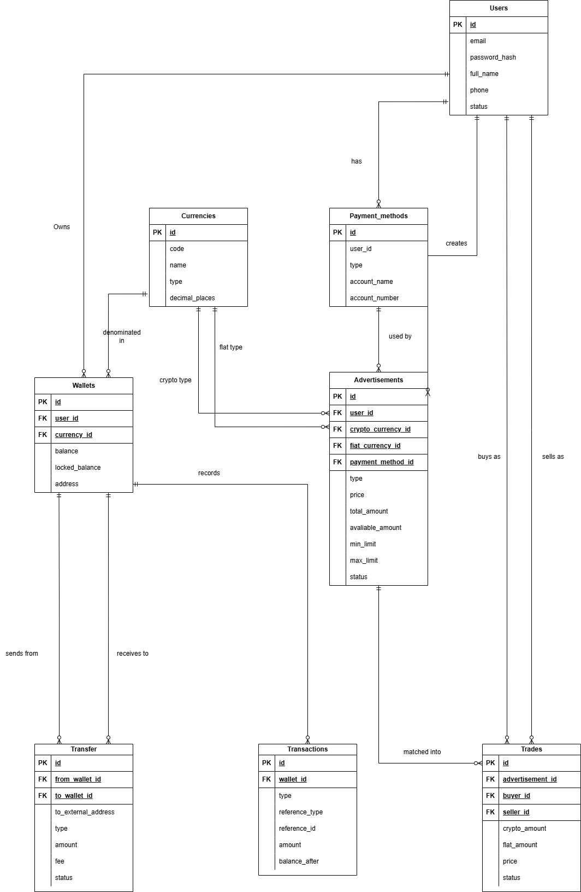

# Crypto Exchange Backend

A backend system for a Cryptocurrency P2P Exchange, developed using Node.js, Express, Prisma ORM, and PostgreSQL. It fulfills all the requirements of the crypto exchange backend assessment.

---

## Part 1: ER Diagram
> **Note:** Please export your ER Diagram from draw.io, name it `er-diagram.png`, and place it in this root folder so it displays below.



**The database schema supports:**
- `Users`: Stores user accounts.
- `Wallets`: 1-to-Many relationship (each user has multiple wallets for BTC, ETH, THB, etc.).
- `Currencies`: Supports both Fiat (THB, USD) and Crypto (BTC, ETH, XRP, DOGE).
- `Payment_methods`: Payment channels (e.g., Bank Transfer, PromptPay).
- `Advertisements`: P2P buy/sell listings.
- `Trades`: P2P trading orders.
- `Transfers`: Internal and external deposit/withdrawal records.
- `Transactions`: A double-entry ledger recording all financial movements.

---

## Part 2: System Features

1. **User Authentication (Auth System)**
   - API `POST /api/auth/register`
   - Upon registration, the system automatically generates wallets for all supported currencies (BTC, ETH, XRP, DOGE, THB, USD), a default payment method, and initial testing balances.
   
2. **P2P Cryptocurrency Trading**
   - API `POST /api/advertisements` to create a sell advertisement (funds are locked in `locked_balance`).
   - API `POST /api/advertisements/:id/trade` to place a buy order.
   - API `PATCH /api/trades/:id/confirm` to confirm fiat payment and transfer crypto to the buyer.

3. **Ledger & Transfer System**
   - API `POST /api/transfers/internal` for internal transfers between users.
   - API `POST /api/transfers/external` for external withdrawals.
   - API `GET /api/wallets/:id/transactions` to view complete transaction history (Ledger).

---

## Setup Guide

### 1. Install Dependencies
```bash
npm install
```

### 2. Configure Database
Create a `.env` file by copying the example template:
```bash
cp .env.example .env
```
*(You can use the default localhost PostgreSQL connection string if you do not have a remote database.)*

### 3. Database Migration & Seeding
```bash
npx prisma migrate dev --name init
npx prisma db seed
```

### 4. Start the Server
```bash
npm run dev
```
The API will run at `http://localhost:3000`.

---

## API Testing (Using Postman or cURL)

You can test the API endpoints using **Postman**, **Insomnia**, or **cURL**. Below is the recommended testing flow:

### 1. Register a new user
```bash
curl -X POST http://localhost:3000/api/auth/register \
  -H "Content-Type: application/json" \
  -d '{"email":"testuser@example.com","password":"password123","full_name":"Test User","phone":"0800000000"}'
```
*(This will automatically create wallets, give starting balances, and generate a default payment method.)*

### 2. Login
```bash
curl -X POST http://localhost:3000/api/auth/login \
  -H "Content-Type: application/json" \
  -d '{"email":"testuser@example.com","password":"password123"}'
```
*(Copy the `token` from the response. You will need to attach it as a `Bearer Token` in the Authorization header for all subsequent requests.)*

### 3. Check Wallets & Balances
```bash
curl -X GET http://localhost:3000/api/wallets \
  -H "Authorization: Bearer YOUR_TOKEN_HERE"
```

### 4. Internal Transfer
```bash
curl -X POST http://localhost:3000/api/transfers/internal \
  -H "Authorization: Bearer YOUR_TOKEN_HERE" \
  -H "Content-Type: application/json" \
  -d '{
    "from_wallet_id": "1",
    "to_wallet_id": "2",
    "amount": "0.05",
    "fee": "0"
  }'
```
*(Replace `from_wallet_id` and `to_wallet_id` with real IDs from your Wallets response)*

### 5. External Transfer
```bash
curl -X POST http://localhost:3000/api/transfers/external \
  -H "Authorization: Bearer YOUR_TOKEN_HERE" \
  -H "Content-Type: application/json" \
  -d '{
    "from_wallet_id": "1",
    "to_external_address": "bc1qxy2kgdygjrsqtzq2n0yrf2493p83kkfjhx0wlh",
    "amount": "0.02",
    "fee": "0.0001"
  }'
```
*(Note: `to_external_address` can be any random text/string since this is a mockup testing the withdrawal logic)*

### 6. Create P2P Advertisement (Sell)
```bash
curl -X POST http://localhost:3000/api/advertisements \
  -H "Authorization: Bearer YOUR_TOKEN_HERE" \
  -H "Content-Type: application/json" \
  -d '{
    "crypto_currency_id": "8",
    "fiat_currency_id": "11",
    "payment_method_id": "1",
    "type": "sell",
    "price": "2450000",
    "total_amount": "0.5",
    "min_limit": "1000",
    "max_limit": "500000"
  }'
```
*(Replace `payment_method_id` with your actual payment method ID from the database)*

### 7. Buy Crypto (Create Trade)
```bash
curl -X POST http://localhost:3000/api/advertisements/1/trade \
  -H "Authorization: Bearer YOUR_TOKEN_HERE" \
  -H "Content-Type: application/json" \
  -d '{
    "crypto_amount": "0.1"
  }'
```
*(Change `1` in the URL to the Advertisement ID you want to buy from)*

### 8. Confirm Trade
```bash
curl -X PATCH http://localhost:3000/api/trades/1/confirm \
  -H "Authorization: Bearer YOUR_TOKEN_HERE"
```
*(Change `1` in the URL to the Trade ID generated in step 7)*

### 9. View Transaction History (Ledger)
```bash
curl -X GET http://localhost:3000/api/wallets/1/transactions \
  -H "Authorization: Bearer YOUR_TOKEN_HERE"
```
*(Change `1` in the URL to your Wallet ID)*

---

## View Database (Prisma Studio)

You can view the tables and actual data using a web-based database GUI by running:
```bash
npx prisma studio
```
This will open `http://localhost:5555` in your browser, allowing you to easily check wallet balances and transaction histories.
